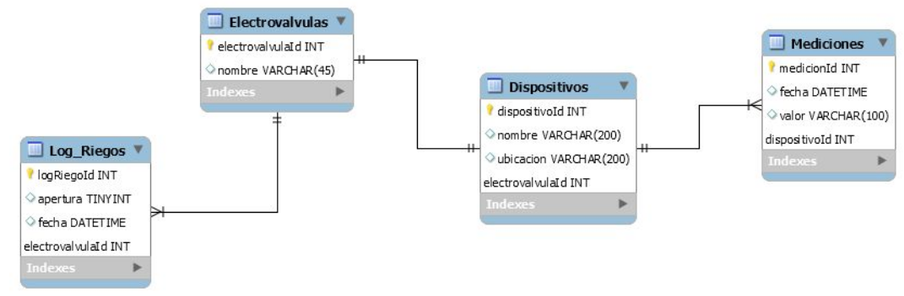

MIoT - DAM: Trabajo Final - Backend
=======================

## Primeros pasos

### Instalar las dependencias

Para correr este código es necesario contar con Docker y Docker-compose instalados. Para instalarlos en Linux, se pueden seguir los pasos del siguiente [artículo](https://www.gotoiot.com/pages/articles/docker_installation_linux/).

### Descargar el código

Para descargar el código se debe ejecutar el siguiente comando:
```
git clone https://github.com/mmondani/MIoT_DAM_Backend
```

### Ejecutar el código

Para ejecutar el backend se debe correr el comando `docker-compose` desde la raiz del proyecto. Para más información sobre la implementación, ver la siguiente sección.

## Detalles de implementación

El backend se compone de 3 contenedores:

- Base de datos MySQL
- phpMyAdmin
- API REST

### Base de datos

La base de datos se compone de 4 tablas:

- Dispositivos
- Electrovávulas
- Log-Riegos
- Mediciones

El diagrama de la base de datos es el siguiente:



Para poder administrar la base de datos, se puede acceder a la instancia de phpMyAdmin que está corriendo en `http:localhost.com:8001/`

### API REST

Dentro del backend corre una API REST en la dirección `http:localhost.com:8000/`.

En la carpeta `doc` del repositorio puede encontrarse un archivo JSON con la colección de requests para Postman.

Una descripción de los endpoints disponibles puede verse a continuación:

<summary>Módulo de dispositivos</summary>
<details>

* **URL:** /dispositivo

* **Descripción:** Permite obtener toda la lista de dispositivos

* **Método:** `GET`
  
*  **Parámetros URL:** -

*  **Body:** -

* **Respuesta exitosa:**

  * **Código:** 200 <br />
    **Body:** array con todos los dispositivos
    <br>
    *Ejemplo*
    ```json
    [
        {
            dispositivoId: 1,
            nombre: "Dispositivo 1",
            ubicacion: "Patio",
            electrovalvulaId: 1
        },
        {
            dispositivoId: 2,
            nombre: "Dispositivo 2",
            ubicacion: "Frente",
            electrovalvulaId: 2
        }
    ]
    ```
 
* **Respuesta fallida:**

  * **Código:** 500 <br />
    **Body:** -

<br/>
---
<br/>

* **URL:** /dispositivo/:id

* **Descripción:** Permite obtener toda la lista de dispositivos

* **Método:** `GET`
  
*  **Parámetros URL:** 
    `id=[number]`: ID del dispositivo que se está consultando.

*  **Body:** -

* **Respuesta exitosa:**

  * **Código:** 200 <br />
    **Body:** dispositivo con ID id
    <br>
    *Ejemplo*
    ```json
    {
        dispositivoId: 1,
        nombre: "Dispositivo 1",
        ubicacion: "Patio",
        electrovalvulaId: 1
    }
    ```
 
* **Respuesta fallida:**

  * **Código:** 400 <br />
    **Body:** objeto indicando el error. Posibles errores:<br />
                - No se encuentra el id<br />
    <br>
    *Ejemplo*
    ```json
    {
        "errores": ["No se encuentra el id"]
    }
    ```
</details>

<br/>
<summary>Módulo de mediciones</summary>
<details>

* **URL:** /medicion/:id

* **Descripción:** Permite todas las mediciones de un dispositivo

* **Método:** `GET`
  
*  **Parámetros URL:** 
    `id=[number]`: ID del dispositivo que se está consultando.

*  **Body:** -

* **Respuesta exitosa:**

  * **Código:** 200 <br />
    **Body:** array con todas las mediciones
    <br>
    *Ejemplo*
    ```json
    [
        {
            medicionId: 1,
            fecha: "2020-11-26 21:19:41",
            valor: "60",
            dispositivoId: 1
        },
        {
            medicionId: 2,
            fecha: "2020-11-26 21:20:41",
            valor: "35",
            dispositivoId: 2
        }
    ]
    ```
 
* **Respuesta fallida:**

  * **Código:** 400 <br />
    **Body:** objeto indicando el error. Posibles errores:<br />
                - No se encuentra el id<br />
    <br>
    *Ejemplo*
    ```json
    {
        "errores": ["No se encuentra el id"]
    }
    ```

<br/>
---
<br/>

* **URL:** /medicion/last/:id

* **Descripción:** Permite obtener la última medicion de un dispositivo

* **Método:** `GET`
  
*  **Parámetros URL:** 
    `id=[number]`: ID del dispositivo que se está consultando.

*  **Body:** -

* **Respuesta exitosa:**

  * **Código:** 200 <br />
    **Body:** última medición del dispositivo con ID id
    <br>
    *Ejemplo*
    ```json
    {
        dispositivoId: 1,
        nombre: "Dispositivo 1",
        ubicacion: "Patio",
        electrovalvulaId: 1
    }
    ```
 
* **Respuesta fallida:**

  * **Código:** 400 <br />
    **Body:** objeto indicando el error. Posibles errores:<br />
                - No se encuentra el id<br />
    <br>
    *Ejemplo*
    ```json
    {
        "errores": ["No se encuentra el id"]
    }
    ```

<br/>
---
<br/>

* **URL:** /medicion

* **Descripción:** Permite agregar una medición para el disposito ID

* **Método:** `POST`
  
*  **Parámetros URL:** -

*  **Body:**
   
    **Obligatorios:**
 
   `id=[number]`: ID del dispositivo.<br/>
   `valor [string]`: valor de la medición
   <br/>
   *Ejemplo*
    ```json
    {
        "id": 1,
        "valor": "50"
    }
    ```

* **Respuesta exitosa:**

  * **Código:** 200 <br />
    **Body:** -
 
* **Respuesta fallida:**

  * **Código:** 400 <br />
    **Body:** objeto indicando el error. Posibles errores:<br />
                - Falta el campo id<br />
                - Falta el campo valor<br />
    <br>
    *Ejemplo*
    ```json
    {
        "errores": ["No se encuentra el id"]
    }
    ```

</details>


<br/>
<summary>Módulo de riegos</summary>
<details>

* **URL:** /riego/:id

* **Descripción:** Obtiene todas las entradas del log de riego de una electroválvula

* **Método:** `GET`
  
*  **Parámetros URL:** 
    `id=[number]`: ID de la electroválvula que se está consultando.

*  **Body:** -

* **Respuesta exitosa:**

  * **Código:** 200 <br />
    **Body:** array con todas las entradas del log de riego
    <br>
    *Ejemplo*
    ```json
    [
        {
            logRiegoId: 1,
            apertura: "2020-11-26 21:19:41",
            fecha: "60",
            electrovalvulaId: 1
        },
        {
            logRiegoId: 2,
            apertura: "2020-11-26 21:20:41",
            fecha: "35",
            electrovalvulaId: 1
        }
    ]
    ```
 
* **Respuesta fallida:**

  * **Código:** 400 <br />
    **Body:** objeto indicando el error. Posibles errores:<br />
                - No se encuentra el id<br />
    <br>
    *Ejemplo*
    ```json
    {
        "errores": ["No se encuentra el id"]
    }
    ```

<br/>
---
<br/>

* **URL:** /riego/last/:id

* **Descripción:** Permite obtener la última entrada del log de riego de una electrovávula

* **Método:** `GET`
  
*  **Parámetros URL:** 
    `id=[number]`: ID de la electroválvula que se está consultando.

*  **Body:** -

* **Respuesta exitosa:**

  * **Código:** 200 <br />
    **Body:** última entrada del log
    <br>
    *Ejemplo*
    ```json
    {
        logRiegoId: 1,
        apertura: "2020-11-26 21:19:41",
        fecha: "60",
        electrovalvulaId: 1
    }
    ```
 
* **Respuesta fallida:**

  * **Código:** 400 <br />
    **Body:** objeto indicando el error. Posibles errores:<br />
                - No se encuentra el id<br />
    <br>
    *Ejemplo*
    ```json
    {
        "errores": ["No se encuentra el id"]
    }
    ```

<br/>
---
<br/>

* **URL:** /riego

* **Descripción:** Permite agregar una nueva entrada al log de riego para la electrovávula ID

* **Método:** `POST`
  
*  **Parámetros URL:** -

*  **Body:**
   
    **Obligatorios:**
 
   `id=[number]`: ID de la electrovávula.<br/>
   `apertura [number]`: indica si es una apertura (1) o un cierre (0)
   <br/>
   *Ejemplo*
    ```json
    {
        "id": 1,
        "apertura": 1
    }
    ```

* **Respuesta exitosa:**

  * **Código:** 200 <br />
    **Body:** -
 
* **Respuesta fallida:**

  * **Código:** 400 <br />
    **Body:** objeto indicando el error. Posibles errores:<br />
                - Falta el campo id<br />
                - Falta el campo apertura<br />
    <br>
    *Ejemplo*
    ```json
    {
        "errores": ["No se encuentra el id"]
    }
    ```

</details>